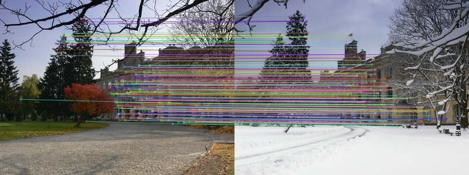

[](https://github.com/xmba15/torch_cpp/actions/workflows/build.yml)

# 📝 torch_cpp

---

## 🎛 Dependencies

---

- [CUDA Toolkits](https://developer.nvidia.com/cuda-toolkit): if you use GPU.

- pytorch c++ API: the easiest way is to reuse build binary provided from [pytorch official website](https://pytorch.org/get-started/locally/). Here is [the sample script to install use the build binary](https://github.com/xmba15/dockerfiles/tree/master/torch_cpp/scripts). For convenience, this repo assumes torch c++ api is installed into _/opt/libtorch_

- other dependencies:

```bash
sudo apt-get install -y --no-install-recommends \
    libopencv-dev
```

## 🔨 How to Build

---

```bash
# build library
make default

# build examples
make apps -j`nproc`

# build gpu examples
make gpu_apps -j`nproc`
```

## :running: How to Run

### [SuperPoint](https://arxiv.org/pdf/1712.07629.pdf) and [SuperGlue](https://arxiv.org/pdf/1911.11763.pdf)

---

<p align="center" width="100%">
    
</p>

<details>
<summary>Usage</summary>

- Script pre-trained superpoint and superglue weights

```bash
git submodule update --init --recursive
export ROOT_DIR="$(pwd)"
python3 -m pip install -r $ROOT_DIR/scripts/superglue/SuperGluePretrainedNetwork/requirements.txt
cd $ROOT_DIR/scripts/superglue/SuperGluePretrainedNetwork/
git apply ../jit_patch.patch
cd $ROOT_DIR
python3 $ROOT_DIR/scripts/superglue/jit_superglue_model.py
python3 $ROOT_DIR/scripts/superglue/jit_superpoint_model.py
```

- Test inference apps

```bash
./build/examples/match_images_superglue/match_images_superglue_app path/to/superpoint_model.pt path/to/superglue_model.pt ./data/images/VisionCS_0a.png ./data/images/VisionCS_0b.png
```

</details>

<p align="right">(<a href="#readme-top">back to top</a>)</p>

## :gem: References

---

- [SuperGlue trained by magicleap](https://github.com/magicleap/SuperGluePretrainedNetwork)
- [SuperPoint SLAM](https://github.com/KinglittleQ/SuperPoint_SLAM)
- [Torch Tracing vs Torch Scripting](https://ppwwyyxx.com/blog/2022/TorchScript-Tracing-vs-Scripting/)

<p align="right">(<a href="#readme-top">back to top</a>)</p>
